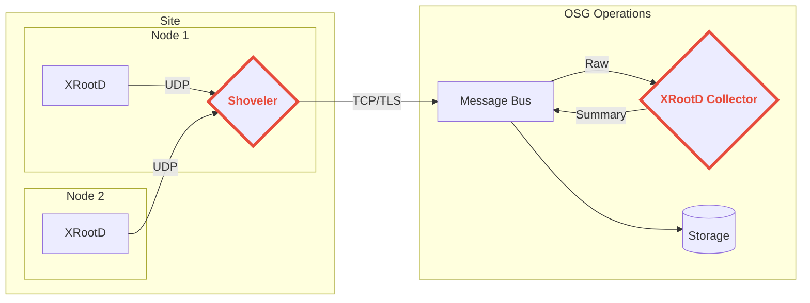
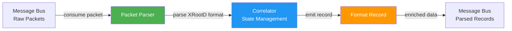

<div align="center">

  <h1>XRootD Monitoring Shoveler</h1>
  
  <p>
    This project provides tools for gathering UDP monitoring messages from XRootD servers and sending them to a reliable message bus. It includes two binaries: <code>shoveler</code> for minimal processing and high throughput, and <code>xrootd-monitoring-collector</code> for full packet parsing and correlation.
  </p>

<!-- Badges -->
  <p>
    
    
    
    <a href="https://pkg.go.dev/github.com/opensciencegrid/xrootd-monitoring-shoveler">
       
    </a>
    <a href="https://github.com/opensciencegrid/xrootd-monitoring-shoveler/blob/main/LICENSE.txt">
       
    </a>
  </p>
 
  <h4>
    <a href="https://opensciencegrid.org/docs/data/xrootd/install-shoveler/">Documentation</a>
  <span> · </span>
    <a href="https://github.com/opensciencegrid/xrootd-monitoring-shoveler/issues/">Report Bug</a>
  <span> · </span>
    <a href="https://github.com/opensciencegrid/xrootd-monitoring-shoveler/issues/">Request Feature</a>
  </h4>
</div>



<!-- Table of Contents -->
# :notebook_with_decorative_cover: Table of Contents

- [:notebook\_with\_decorative\_cover: Table of Contents](#notebook_with_decorative_cover-table-of-contents)
  - [Getting Started](#getting-started)
    - [Requirements](#requirements)
    - [:gear: Installation](#gear-installation)
  - [Configuration](#configuration)
    - [Operating Modes](#operating-modes)
    - [Message Bus Credentials](#message-bus-credentials)
    - [Packet Verification](#packet-verification)
    - [IP Mapping](#ip-mapping)
    - [Src/Dst Site Resolution](#srcdst-site-resolution)
    - [WLCG Site Behaviour](#wlcg-site-behaviour)
  - [Running the Shoveler](#running-the-shoveler)
  - [Testing Packet Flow with the Collector](#testing-packet-flow-with-the-collector)
  - [:compass: Design](#compass-design)
    - [Operating Modes](#operating-modes-1)
    - [Queue Design](#queue-design)
  - [:warning: License](#warning-license)
  - [:gem: Acknowledgements](#gem-acknowledgements)

## Getting Started

### Requirements

1. An open UDP port from the XRootD servers, defaults to port 9993.  The port does not need to be open to the public 
   internet, only the XRootD servers.
2. Outgoing network access to connect to the message bus.
3. Disk space for a persistent message queue if the shoveler is disconnected from the message bus.
[Calculations](https://gist.github.com/djw8605/79b3b5a3f5b928f2f50ff469ce57d028) have shown production servers 
   generate <30 MB of data a day.

The shoveler can run on a dedicated server or on a shared server.  The shoveler does not require many resources.
For example, a shoveler serving 12 production XRootD servers can be expected to consume 10-50 MB of ram, 
and require a small fraction of a CPU.

### :gear: Installation

Binaries and packages are provided in the latest Github [releases](https://github.com/opensciencegrid/xrootd-monitoring-shoveler/releases).

## Configuration

The shoveler reads configuration from multiple sources with the following precedence (highest to lowest):

1. **Command line arguments** - Highest priority
2. **Environment Variables** - Override config file settings
3. **Configuration file** - Default configuration source

### Command Line Arguments

Both `shoveler` and `xrootd-monitoring-collector` binaries support the following flags:

```bash
# Specify custom configuration file path
./bin/shoveler -c /path/to/config.yaml
./bin/shoveler --config /path/to/config.yaml

# Display help
./bin/shoveler -h
```

### Configuration File

An example configuration file, [config.yaml](config/config.yaml) is in the repo. By default, the shoveler searches for configuration files in the following locations (in order):

1. `/etc/xrootd-monitoring-shoveler/config.yaml`
2. `$HOME/.xrootd-monitoring-shoveler/config.yaml`
3. `./config.yaml` (current directory)
4. `./config/config.yaml`

You can override this by specifying a custom path with `-c` or `--config`.

### Environment Variables

Every configuration option can be set via environment variables using the `SHOVELER_` prefix. Nested configuration keys use underscores. For example:

- `mode` → `SHOVELER_MODE`
- `listen.port` → `SHOVELER_LISTEN_PORT`
- `amqp.url` → `SHOVELER_AMQP_URL`
- `state.entry_ttl` → `SHOVELER_STATE_ENTRY_TTL`

When running as a daemon, environment variables can be set in `/etc/sysconfig/xrootd-monitoring-shoveler`.

### Operating Modes

The system provides two separate binaries for different use cases:

#### Shoveler Binary (`shoveler`)

The traditional shoveler performs minimal processing:
- Validates packet boundaries and type
- Forwards packets to message bus with minimal overhead  
- Preserves current behavior for maximum throughput
- Suitable for high-volume environments

Run with: `shoveler` (or `shoveler -c /path/to/config.yaml`)

#### Collector Binary (`xrootd-monitoring-collector`)

The collector performs full packet parsing and correlation:
- Parses XRootD monitoring packets according to the [XRootD monitoring specification](https://xrootd.web.cern.ch/doc/dev6/xrd_monitoring.htm#_Toc204013498)
- Correlates file open and close events to compute latency and throughput
- Maintains stateful tracking of file operations with TTL-based cleanup
- Emits structured collector records with detailed metrics
- Tracks parsing performance and state management via Prometheus metrics
- **WLCG Format Conversion**: Converts records to [WLCG format](https://twiki.cern.ch/twiki/bin/view/Main/GenericFileMonitoring) when:
  - The VO is `cms`, OR the file path starts with `/store` or `/user/dteam`
  - WLCG records are sent to a separate exchange (`amqp.exchange_wlcg`) instead of the main exchange
  - Cache gstream events with `/store` or `/user/dteam` paths are converted and sent to `amqp.exchange_wlcg_cache`
  - TPC gstream events with WLCG source/destination paths are converted and sent to `amqp.exchange_wlcg_tpc`
  - A WLCG site can convert everything and determine each record's VO with `wlcg.enabled`; see [WLCG Site Behaviour](#wlcg-site-behaviour)

Run with: `xrootd-monitoring-collector` (or `xrootd-monitoring-collector -c /path/to/config.yaml`)

Configure state management parameters:

```yaml
state:
  entry_ttl: 300              # Time-to-live for state entries in seconds
  max_entries: 10000          # Maximum state entries (0 for unlimited)
```

See [config-collector.yaml](config/config-collector.yaml) for a complete example.

#### Available Environment Variables

> **Note on environment variable prefixes:** The `xrootd-monitoring-shoveler` binary uses the `SHOVELER_` prefix for all environment variables. The `xrootd-monitoring-collector` binary uses the `COLLECTOR_` prefix for all environment variables. For example, to set the input type in collector mode, use `COLLECTOR_INPUT_TYPE` instead of `SHOVELER_INPUT_TYPE`.

**General Configuration (shoveler: `SHOVELER_`, collector: `COLLECTOR_`):**
* `<PREFIX>_DEBUG` - Enable debug logging: `true` or `false`
* `<PREFIX>_VERIFY` - Verify packet format: `true` or `false` (default: `true`)

**Input Configuration (shoveler: `SHOVELER_INPUT_*`, collector: `COLLECTOR_INPUT_*`):**
* `<PREFIX>_INPUT_TYPE` - Input source: `udp`, `file`, or `rabbitmq` (default: `udp`)
* `<PREFIX>_INPUT_HOST` - Input host address
* `<PREFIX>_INPUT_PORT` - Input port number
* `<PREFIX>_INPUT_BUFFER_SIZE` - Buffer size for UDP packets (default: `65536`)
* `<PREFIX>_INPUT_BROKER_URL` - Message broker URL (for rabbitmq input)
* `<PREFIX>_INPUT_TOPIC` - Message broker topic/queue name
* `<PREFIX>_INPUT_QUEUE` - Alias for topic (RabbitMQ)
* `<PREFIX>_INPUT_SUBSCRIPTION` - Subscription name (for message bus)
* `<PREFIX>_INPUT_BASE64_ENCODED` - Packets are base64 encoded: `true` or `false` (default: `true`)
* `<PREFIX>_INPUT_PATH` - File path (for file input type)
* `<PREFIX>_INPUT_FOLLOW` - Follow file mode like tail: `true` or `false`

**State Management (Collector Mode only, prefix: `COLLECTOR_`):**
* `COLLECTOR_STATE_ENTRY_TTL` - TTL for state entries in seconds (default: `300`)
* `COLLECTOR_STATE_MAX_ENTRIES` - Maximum state entries, 0 for unlimited (default: `0`)
* `COLLECTOR_STATE_ENABLE_DNS_ENRICHMENT` - Enable DNS enrichment of monitoring records: `true` or `false` (default: `false`)
* `COLLECTOR_STATE_DNS_CACHE_TTL` - DNS cache time-to-live in seconds (default: `3600`)
* `COLLECTOR_STATE_ENRICHMENT_WORKERS` - Number of concurrent DNS enrichment worker routines (default: `5`)
* `COLLECTOR_STATE_ENRICHMENT_QUEUE_SIZE` - Maximum pending DNS enrichment requests kept in memory (default: `1000000`)
* `COLLECTOR_STATE_GSTREAM_WORKERS` - Number of concurrent gstream processing workers (default: `4`)
* `COLLECTOR_STATE_GSTREAM_QUEUE_SIZE` - Maximum pending gstream packets kept in memory before drops (default: `20000`)
* `COLLECTOR_STATE_DNS_TIMEOUT` - DNS query timeout in seconds (default: `2`)

**Output Configuration (shoveler: `SHOVELER_OUTPUT_*`, collector: `COLLECTOR_OUTPUT_*`):**
* `<PREFIX>_OUTPUT_TYPE` - Output destination: `mq`, `file`, or `both` (default: `mq`)
* `<PREFIX>_OUTPUT_PATH` - File path for file output

**Message Queue Configuration (shoveler: `SHOVELER_MQ`, collector: `COLLECTOR_MQ`):**
* `<PREFIX>_MQ` - Message queue type: `amqp` or `stomp` (default: `amqp`)

**AMQP Configuration (shoveler: `SHOVELER_AMQP_*`, collector: `COLLECTOR_AMQP_*`):**
* `<PREFIX>_AMQP_URL` - AMQP broker URL
* `<PREFIX>_AMQP_EXCHANGE` - Main exchange name (default: `shoveled-xrd`)
* `<PREFIX>_AMQP_EXCHANGE_CACHE` - Cache events exchange (default: `xrd-cache-events`)
* `<PREFIX>_AMQP_EXCHANGE_TCP` - TCP events exchange (default: `xrd-tcp-events`)
* `<PREFIX>_AMQP_EXCHANGE_TPC` - TPC events exchange (default: `xrd-tpc-events`)
* `<PREFIX>_AMQP_EXCHANGE_WLCG` - WLCG formatted events exchange (default: `xrd-wlcg-events`)
* `<PREFIX>_AMQP_EXCHANGE_WLCG_CACHE` - WLCG formatted cache events exchange (default: `xrd-wlcg-cache-events`)
* `<PREFIX>_AMQP_EXCHANGE_WLCG_TPC` - WLCG formatted TPC events exchange (default: `xrd-wlcg-tpc-events`)
* `<PREFIX>_AMQP_TOKEN_LOCATION` - JWT token file path (default: `/etc/xrootd-monitoring-shoveler/token`)
* `<PREFIX>_AMQP_PUBLISH_WORKERS` - Number of concurrent publishing workers for collector mode (default: `10`, forced to `1` in shoveler mode)

**STOMP Configuration (shoveler: `SHOVELER_STOMP_*`, collector: `COLLECTOR_STOMP_*`):**
* `<PREFIX>_STOMP_USER` - STOMP username
* `<PREFIX>_STOMP_PASSWORD` - STOMP password
* `<PREFIX>_STOMP_URL` - STOMP broker URL
* `<PREFIX>_STOMP_TOPIC` - STOMP topic (default: `xrootd.shoveler`)
* `<PREFIX>_STOMP_CERT` - Client certificate path
* `<PREFIX>_STOMP_CERTKEY` - Client certificate key path

**Listening Configuration (Shoveler Mode only):**
* `SHOVELER_LISTEN_PORT` - UDP listening port (default: `9993`)
* `SHOVELER_LISTEN_IP` - UDP listening IP address

**Output Destinations (Shoveler Mode only):**
* `SHOVELER_OUTPUTS_DESTINATIONS` - Additional UDP destination addresses

**Metrics (Shoveler Mode only):**
* `SHOVELER_METRICS_ENABLE` - Enable Prometheus metrics: `true` or `false` (default: `true`)
* `SHOVELER_METRICS_PORT` - Metrics HTTP server port (default: `8000`)
* `SHOVELER_METRICS_PER_SERVER` - Enable the opt-in `server_ip`-labelled metrics: `true` or `false` (default: `false`)

**Queue (Shoveler Mode only):**
* `SHOVELER_QUEUE_DIRECTORY` - Persistent queue directory (default: `/var/spool/xrootd-monitoring-shoveler/queue`)

**IP Mapping (Shoveler Mode only):**
* `SHOVELER_MAP_ALL` - Map all IPs to a single address

**WLCG Records (Collector Mode only, prefix: `COLLECTOR_`):**
* `COLLECTOR_WLCG_PRODUCER` - `metadata.producer` for WLCG file-transfer records (default: `cms`)
* `COLLECTOR_WLCG_TYPE` - `metadata.type` for WLCG file-transfer records (default: `aaa-ng`)
* `COLLECTOR_WLCG_GSTREAM_PRODUCER` - `metadata.producer` for WLCG gstream cache/TPC events (default: `cms-xrootd-cache`)

**WLCG site behaviour (Collector Mode only, prefix: `COLLECTOR_`):** none of these do anything unless enabled. See [WLCG Site Behaviour](#wlcg-site-behaviour).
* `COLLECTOR_WLCG_ENABLED` - turn the WLCG-site settings on (default: `false`)
* `COLLECTOR_WLCG_VOS` - only these VOs are included (no default: unset means all)
* `COLLECTOR_WLCG_PATH_PREFIXES` - only these paths are included (no default: unset means all)
* `COLLECTOR_WLCG_EXCLUDE_VOS` - these VOs are excluded from the WLCG feed (default: empty)
* `COLLECTOR_WLCG_EXCLUDE_PATH_PREFIXES` - these path prefixes are excluded (default: empty)
* `COLLECTOR_WLCG_VO` - VO for a collector running at a specific VO (no default)
* `COLLECTOR_WLCG_VO_ORDER` - VO order used to determine `vo` (default: `record scitags config`)

### Message Bus Credentials

When running using AMQP as the protocol to connect the shoveler uses a [JWT](https://jwt.io/) to authorize with the message bus.  The token will be issued by an 
automated process, but for now, long lived tokens are issued to sites. 

On the other hand, if STOMP is the selected protocol user and password will need to be provided when configuring the shoveler.

### Packet Verification

If the `verify` option or `SHOVELER_VERIFY` env. var. is set to `true` (the default), the shoveler will perform 
simple verification that the incoming UDP packets conform to XRootD monitoring packets.

### IP Mapping

When the shoveler runs on the same node as the XRootD server, or in the same private network, the IP of the incoming XRootD
packets may report the private IP address rather than the public IP address.  The public ip address is used for reverse
DNS lookup when summarizing the records.  You may map incoming IP addresses to other addresses with the `map` configuration value.

To map all incoming messages to a single IP:

```
map:
  all: <ip address>
```

or the environment variable SHOVELER_MAP_ALL=<ip address>

To map multiple ip addresses, the config file would be:
   
```
map:
   <ip address>: <ip address>
   <ip address>: <ip address>
   
```

### Src/Dst Site Resolution

**Collector mode only, WLCG records only.** The collector resolves each end of a
transfer to its WLCG **RCSite** (`CERN-PROD`, `AGLT2`, …) and stamps four fields
on the WLCG-formatted record — `src_site`, `dst_site`, and a `src_site_status` /
`dst_site_status` saying how (or whether) each end resolved. The fields are
ordered by data-flow direction: on a read the server is the source and the client
the destination; on a write they are inverted.

Records that are not routed to the WLCG exchange are left exactly as they are
today — the plain collector record gains no new fields, and resolution is skipped
for those records entirely rather than computed and discarded.

Resolution uses snapshots of the [CRIC](https://wlcg-cric.cern.ch/) domain map
and network routes that are **embedded in the binary**, so it works out of the
box with no network access and no per-record lookups. It is on by default.

Each endpoint is resolved by trying identifiers in the configured order and
taking the first hit:

| method | matches on | CRIC source |
|---|---|---|
| `config` | `site.local_site`, the site this collector runs at | declared, no lookup |
| `hostname` | exact host of a CRIC **SE protocol endpoint** | service API `query/?json&type=SE` |
| `ip` | longest-prefix **CIDR containment** | netroutes `rcsite/query` |
| `domain` | longest matching **domain suffix** | domains preset `besttier=1` |

The default order is `["config", "hostname", "ip", "domain"]`: the operator's own
declaration first (nothing inferred beats it, and it needs no DNS), then the
identifiers from most to least specific. Leaving a method out of the list turns
it off. `site.overrides` is not one of these — it is consulted before the order
runs and wins outright (see below).

> **`hostname` and `domain` need a name, and the server end only has one with DNS
> enrichment on.** The client name arrives in the xrootd user record and is used
> as-is, but the server end is derived from the packet's source address and is
> always an IP literal, which the domain map deliberately refuses to match. Since
> `state.enable_dns_enrichment` defaults to `false`, both name-based methods are
> inert for *every server endpoint* under the shipped defaults, leaving `config`
> and `ip` to resolve that end. The collector warns at startup when the order
> asks for a name-based method that DNS has made inert, and stays quiet once
> either of those is in place.
>
> What DNS actually buys is narrower than it looks: it only changes the outcome
> when an endpoint is an address, **no** CRIC netroute CIDR covers it, and the
> domain map does know its domain. A server on `203.0.113.9` with no CIDR match
> is `no_host` with DNS off and `resolved` via `cern.ch` with it on; the same
> server inside a declared CIDR resolves either way, since `ip` precedes `domain`.
>
> `site.local_site` covers the *server* end only, in both directions — it provides
> where the reporting server sits, so it lands on `src` for a read and `dst` for
> a write. A **remote client** on an address CRIC declares no range for still has
> no name-based path with DNS off, and `config` does not apply to it (that extends
> only to private/loopback clients, via `site.local_site_lan_clients`). Whether
> that bites depends on what your servers report, so it shows up in
> `shoveler_site_unresolved` rather than in the startup warning. Roles alternate
> there too: an unresolved client is `role="dst"` on reads and `role="src"` on
> writes, so check both before concluding one direction is worse.

**If your collector serves a single site, set `site.local_site`.** It is the one
thing you know for certain — every server reporting to that collector is at that
site — and it resolves the server end with no DNS and no CRIC coverage
dependency. It also covers clients on private addresses (your own worker nodes),
which CRIC declares no ranges for.

```yaml
site:
  enabled: true                 # false disables src_site/dst_site entirely
  local_site: CERN-PROD         # leave empty on a collector aggregating several sites
  local_site_lan_clients: true  # also apply local_site to private/loopback clients
  resolution_order: ["config", "hostname", "ip", "domain"]

  # Off by default. When enabled, a pin is consulted before any CRIC lookup and
  # wins outright. A key is an exact host, a domain suffix, an address, or a CIDR.
  overrides_enabled: true
  overrides:
    scotgrid.ac.uk: UKI-SCOTGRID-GLASGOW
    159.93.39.0/24: JINR-T1

  # All three maps default to the embedded snapshots. Point these at a file path
  # or an http(s):// URL to follow CRIC live; a URL is re-fetched on the interval
  # and a failed refresh keeps the previous data.
  source: ""                    # domains map, backing "domain"
  refresh_interval: 86400
  hostname_enabled: true        # SE endpoints, backing "hostname"
  hostname_source: ""
  hostname_refresh_interval: 86400
  ip_enabled: true              # netroutes, backing "ip"
  ip_source: ""
  ip_refresh_interval: 86400
```

Equivalent environment variables use the collector prefix, e.g.
`COLLECTOR_SITE_LOCAL_SITE`, `COLLECTOR_SITE_ENABLED`, `COLLECTOR_SITE_SOURCE`.

#### Reading the emitted fields

`src_site` / `dst_site` are empty unless the matching status is one of the
resolved ones, and all four are omitted from the JSON when empty. The two
endpoints behind them:

- **server** — the monitored XRootD server. **Its IP is always known** (it is the
  UDP packet's source address). On a read it is the source; on a write the
  destination.
- **client** — the peer that connected (a grid job / worker node, or a TPC peer).
  On a read it is the destination; on a write the source.

| status | the end was resolved… |
|---|---|
| `resolved_override` | pinned by the sites in `site.overrides` |
| `resolved_config` | from `site.local_site` — the operator's declaration, no lookup |
| `resolved_hostname` | by an **exact CRIC SE endpoint** host (`xrootd.aglt2.org` → `AGLT2`) |
| `resolved` | by **domain suffix** against the CRIC domain map (`x.cern.ch` → `CERN-PROD`) |
| `resolved_ip` | by **address**, inside a CRIC-declared CIDR block |
| `unknown_domain` | not resolved — we had a host name, but it is no SE endpoint and no domain suffix matched |
| `ambiguous` | **a guess** — the domain or range maps to more than one site; the first is reported |
| `no_host` | not resolved — **no usable host name** (bare IP / `unknown` / DNS off) **and** no matching CIDR block |

A domain shared by several RCSites (`desy.de`, `scotgrid.ac.uk`) yields the
first site CRIC lists for it, under the `ambiguous` status — so a consumer that
needs certainty can filter on the status, and one that just wants a usable label
has one. Treat `ambiguous` as unresolved when computing a resolution rate.

**Settling an ambiguous host.** `shoveler_site_unresolved{reason="ambiguous"}`
counts these but cannot name them — a host name in a metric label would be
unbounded cardinality — so the collector logs each ambiguous host once, with its
candidates and the line that fixes it:

```
WARN site: "host.scotgrid.ac.uk" is ambiguous between UKI-SCOTGRID-DURHAM,
     UKI-SCOTGRID-GLASGOW; using "UKI-SCOTGRID-DURHAM" as a guess.
     Pin it with site.overrides: {"host.scotgrid.ac.uk": "UKI-SCOTGRID-DURHAM"}
```

Put that key in `site.overrides`, turn the option on, and the host resolves
definitively from then on with status `resolved_override`:

```yaml
site:
  overrides_enabled: true
  overrides:
    host.scotgrid.ac.uk: UKI-SCOTGRID-GLASGOW
```

Both lines are needed: the keys alone do nothing until the option is on.

**Overriding is off by default.** `site.overrides_enabled` defaults to `false`,
unlike the other `site.*_enabled` flags, and while it is off the pins are ignored
entirely: every endpoint resolves from CRIC alone, and a host CRIC cannot settle
keeps reporting `ambiguous`. A pin beats everything CRIC says, so switching it on
is a deliberate act — this is the escape hatch for a CRIC entry you know is wrong
or that CRIC cannot disambiguate, not routine configuration. Leaving keys in
`site.overrides` with the option off is a no-op, and the collector says so at
startup rather than letting you debug a pin that was never applied.

**With the option on, a pin is the site's own answer and is used.** It is
consulted before any CRIC lookup, so it corrects a CRIC answer as well as settling
one CRIC reports ambiguously. It is **not** a `resolution_order` method and cannot
be scheduled, reordered or left out there.

A key is matched by what it parses as:

| key | matches |
|---|---|
| `xrootd.example.org` | that exact host |
| `example.org` | every host under the suffix |
| `192.0.2.7` | that one address |
| `192.0.2.0/24` | every address in the range (IPv6 CIDRs too) |

Host keys use the domains-map walk (full host first, then broader suffixes,
longest key wins); address keys use longest-prefix containment, so a single
address beats a range containing it. Host keys are tried before address keys, so
a host pinned by name beats a range that merely covers its address.

Address keys matter because the `ip` method reports `ambiguous` when two sites
declare equally specific CIDRs, and an endpoint reported as a bare address has no
name to key on.

Name matching takes the **longest** matching suffix and stops there, so
`n01.gla.scotgrid.ac.uk` resolves via `gla.scotgrid.ac.uk` and never falls
through to the broad `ac.uk`.

The `hostname` method matches the host of a CRIC **storage-element** protocol
endpoint, with scheme and port stripped — `root://xrootd.aglt2.org:1094` makes
`xrootd.aglt2.org` an exact key for `AGLT2`. That is why it sits above `ip` and
`domain`: a storage host CRIC names outright is not a guess, where a suffix match
can over-reach. The embedded snapshot holds 567 hosts across 168 RCSites.

**Expect the client side to resolve less often than the server side.** Clients
are often bare IPs with no PTR record, they are not storage elements so the
`hostname` method cannot name them, and CRIC's ranges cover
storage/LHCOPN/LHCONE networks, not the worker-node subnets clients connect from.
In the embedded snapshot only 143 of 392 sites declare any CIDR range at all.
`site.local_site` removes the server side of that problem outright, and
`site.local_site_lan_clients` covers local worker nodes, which CRIC cannot.

Both count WLCG-bound records only, since those are the only
ones resolved.

#### Refreshing the embedded CRIC snapshots

The snapshots live in `collector/cric_domains.json`, `collector/cric_se.json`
and `collector/cric_netroutes.json`. Point `site.source` / `site.hostname_source`
/ `site.ip_source` at the CRIC URLs to follow them live instead, or regenerate
the committed files with:

```bash
# Domain map. besttier=1 collapses noisy low-tier/test entries
# (cern.ch: [BOINC, CERN-PROD] -> CERN-PROD). Served on the dev instance.
curl -s 'https://wlcg-cric.cern.ch/api/core/rcsite/query/?json&preset=domains&besttier=1' \
  -o collector/cric_domains.json

# Storage-element endpoints, backing the "hostname" method. Reduced to the rcsite
# and protocol endpoints the collector reads; an unreduced response parses
# identically if you drop the jq. "aprotocols" is not kept: it indexes protocol
# names by access pattern rather than carrying endpoints of its own. Nor are the
# lifecycle fields ("state", "status"), which are irrelevant to a host -> site
# mapping - a machine does not change site because one of its doors is retired.
curl -s 'https://wlcg-cric.cern.ch/api/core/service/query/?json&type=SE' \
  | jq -S 'map_values({rcsite, protocols: ((.protocols // {}) | map_values({endpoint}))})
           | with_entries(select(.value.rcsite != null and .value.rcsite != ""
                                 and (.value.protocols | length) > 0))' \
  > collector/cric_se.json

# Network routes. The full rcsite/query response is ~1.1 MB and mostly fields the
# collector ignores, so the committed snapshot is reduced to the netroutes it
# actually reads; an unreduced response parses identically if you drop the jq.
curl -s 'https://wlcg-cric.cern.ch/api/core/rcsite/query/?json' \
  | jq -S 'map_values({netroutes: (.netroutes // {} | map_values({networks: (.networks | {ipv4, ipv6} | with_entries(select(.value != null and (.value | length) > 0)))}) | with_entries(select(.value.networks | length > 0)))})
           | with_entries(select(.value.netroutes | length > 0))' \
  > collector/cric_netroutes.json
```

Address matching is longest-prefix containment over the declared blocks, which is
exactly what CRIC does server-side — replicated locally so no record ever waits on
a network call. The server's self-reported `site` field (from the `=` map packet)
is left untouched; `src_site`/`dst_site` are new fields alongside it.

#### Clients reported by an unqualified name

XRootD reports the client host as it saw it, so a client in the reporting
server's own DNS domain arrives unqualified — `b9p04p7188` rather than
`b9p04p7188.cern.ch`. That endpoint has nothing any resolution method can use:
no domain to suffix-match, no address to place in a netroute, and it is not a
private address, so `site.local_site` cannot claim it either. It lands on
`no_host`, and because a scope needs both ends, the record's `traffic_scope`
comes out `UNKNOWN` however well the server end resolved.

With `state.enable_dns_enrichment` on, such a name is resolved forward during
enrichment: the name is handed to the system resolver as-is, exactly as
`host b9p04p7188` would, and the resolver expands it through the `search` list in
the collector VM's own `/etc/resolv.conf`. **No domain is configured or appended
anywhere in the collector** — a name with no dots gets search expansion by the
default `ndots:1`, so each deployment simply inherits its own site's list. The
address
that comes back feeds the `ip` method, and reverse-resolving it yields the FQDN
the `hostname` and `domain` methods need. A CERN worker node reading from CERN
EOS then resolves through the CRIC netroute that owns its range and the record
becomes `LAN` / `site_internal_traffic: true` instead of `UNKNOWN`.

Answers are cached for `state.dns_cache_ttl`, **including failures**: a busy
worker node that DNS cannot place is looked up once, not once per record. Only
unqualified names trigger it — a client reported as an address or as an FQDN
already carries what the resolver needs.

> **Beware of short names from other sites.** The search list is the collector
> VM's own, so an unqualified name from a remote site is looked up in the
> collector's domain, not in the site that reported it. Usually it simply does
> not resolve and the endpoint stays `no_host`, which is the right answer — a
> bare name is only meaningful inside the DNS that issued it, so no collector can
> place one from elsewhere. The risk is a collision: a client called `wn001` at
> another site, when a `wn001` also exists in the collector's own domain, would be
> placed at the wrong site.

### WLCG Site Behaviour

**Collector mode only.** `wlcg.enabled` turns on the settings a WLCG site needs.
It is off by default, and while it is off none of the keys below do anything:
records are converted by the upstream rule (VO `cms`, or a path under `/store` or
`/user/dteam`) and a record's `vo` is whatever the packet said. That is what lets
OSG and WLCG share one collector.

With it on, every record is converted as a WLCG record. `vos` and `path_prefixes`
have no defaults, so nothing limits that unless you set them.

You can include, exclude specific VOs and path prefixes. You can also set the VO
order in which the VO is determined (default is `["record", "scitags",
"config"]`). The first VO that is found is used.

```yaml
wlcg:
  enabled: true
  vos: ["cms"]                                # only these VOs are included; unset means all
  path_prefixes: ["/store"]                   # only these paths are included; unset means all
  exclude_vos: ["dune", "belle2", "skao"]     # These VOs are excluded from the WLCG feed
  exclude_path_prefixes: ["/pnfs/dune"]       # These path prefixes are excluded from the WLCG feed
  vo: cms                                     # VO set for a collector running at a specific VO
  vo_order: ["record", "scitags", "config"]   # VO order to determine the resolution of the VO
```

#### What becomes a WLCG record

A record matching any VO (case-insensitive) or any path prefix is included; the
rest stay on the main exchange. Setting just one list leaves that one working on
its own, and an explicit `[]` is the same as leaving a list out.

Leaving both unset includes everything. That is also the only rule that covers
records with no VO, and most have none: a VO only shows up when the auth or token
stream sent one, so no VO list would pick them up.

`exclude_vos` and `exclude_path_prefixes` take records out again, for a site that
also serves non-LHC VOs. Those records are published as plain collector records
on the main exchange instead. Both default to empty, and they can only take
records out, never add them.

> **Scope:** these rules cover file-transfer (file-close) records. Which gstream
> cache and TPC events are converted is still decided by the hardcoded `/store`
> and `/user/dteam` check, unchanged from upstream.

#### How the VO is determined

A record can get its VO from three places and often has none of them, so a WLCG
record carries four fields:

| field | where it comes from | may be missing |
|---|---|---|
| `record_vo` | the auth/token stream, what the record itself said | yes, and usually is |
| `scitags_vo` | the SciTags experiment name, from the `U` stream | yes |
| `vo` | the one to read, determined from the other two and `wlcg.vo` | only if all three are |
| `vo_source` | which source `vo` came from: `record`, `scitags` or `config` | only when `vo` is |

`record_vo` and `scitags_vo` are published as-is and `vo_source` says which one
was used, so a consumer can see where `vo` came from. All four go on the record
itself, not in the `metadata` block, because MONIT checks that block against a
fixed schema.

`vo_order` sets the order the sources are tried in and the first VO that is found
is used. The default tries the record before `wlcg.vo`, since the configured VO
says the same thing for every record. Reorder it to change that: `["config",
"record", "scitags"]` makes `wlcg.vo` win.

Leaving a source out turns it off. An order without `config` never uses
`wlcg.vo`, and one without `scitags` keeps SciTags out of `vo` while still
publishing `scitags_vo`. Unknown or repeated names are dropped with a warning,
and an empty list falls back to the default, the same as
[`site.resolution_order`](#srcdst-site-resolution).

`wlcg.vo` is for a collector running at a specific VO whose records carry none.
**Leave it unset on a collector serving several VOs**, or every record that
reported nothing gets the wrong VO.

With `wlcg.enabled` off, `vo` is the packet's own VO and `record_vo` is not
written at all, so the wire format is unchanged for consumers that do not know
about it.

#### The VO is determined first

It is determined before any rule sees the record, so `filter.drop_vos`, `vos` and
`exclude_vos` all match the same value:

```
determine vo / vo_source          ← wlcg.vo_order
   ↓
drop filter (filter.drop_vos)     ← that VO
   ↓
WLCG routing (vos, exclude_vos)   ← that VO
   ↓
convert, publish
```

Most records have no VO from the auth or token stream, so those rules would have
almost nothing to match otherwise. A record whose VO came from SciTags or from
`wlcg.vo` can now be dropped, included or excluded by it.

> **Take care with `filter.drop_vos`.** It matches a VO the collector determined
> rather than one the record sent, and dropping cannot be undone: a dropped
> record goes nowhere and only shows up as a count in
> `shoveler_records_dropped`. If `wlcg.vo: cms` is set, every record that
> reported no VO gets `cms`, so `drop_vos: ["cms"]` throws the whole feed away.
> Check `vo_source` on a sample first.

With `wlcg.enabled` off nothing is determined, and every rule matches the VO from
the packet, as upstream.

#### Internal traffic flags

Every WLCG record answers two independent questions about the transfer: where it
went on the network, and who generated it. Three fields carry the answers, next
to the `user` the record already had:

| field | type | meaning |
|---|---|---|
| `traffic_scope` | `LAN` / `WAN` / `UNKNOWN` | the canonical topology answer |
| `site_internal_traffic` | bool, or absent | both ends at the same site; absent when the topology is unknown |
| `xrootd_internal_traffic` | bool | XRootD generated the operation itself, rather than an end user |

They are written only while `wlcg.enabled` is on. `wlcg.traffic_enabled` (default
true) switches them off again, and a collector with either off emits exactly what
it emitted before.

##### Network scope

The scope is read from the `src_site` and `dst_site`
[the site resolver](#srcdst-site-resolution) already worked out:

| src/dst sites | `traffic_scope` | `site_internal_traffic` |
|---|---|---|
| both resolved, equal | `LAN` | `true` |
| both resolved, different | `WAN` | `false` |
| either one unresolved | `UNKNOWN` | **not written** |

`site_internal_traffic` is derived from the scope, so the two can never
disagree: `LAN` always means `true`, `WAN` always means `false`, and an
unresolved topology means the field is left off the record rather than published
as a `false`. That is deliberate — `false` says the two ends *were* resolved and
turned out to be different sites, which is not what an unresolved endpoint knows.
Read `traffic_scope == "UNKNOWN"` for that case, or `src_site_status` /
`dst_site_status` for why.

An endpoint CRIC reports **ambiguously** does not settle the topology either: the
site named there is explicitly a guess, so such a record is `UNKNOWN` rather than
a definite `LAN` or `WAN`.

Site resolution can be off (`site.enabled: false`) while these flags are on; every
scope is then `UNKNOWN`, and `xrootd_internal_traffic` still works, because the
two axes are independent.

##### XRootD-internal traffic

`xrootd_internal_traffic` says the operation is the infrastructure's own work
rather than a user's. The rules are the ones the MonALISA xrootd collector uses and are suggested by the XrootD team
(`isActualUser` in `lia/Monitor/modules/monXrootd.java`), checked in this order,
first hit wins:

1. an account is one of `wlcg.traffic_internal_users` (default `root`)
2. an account is an all-digit job-agent id within
   `wlcg.traffic_job_agent_min`-`wlcg.traffic_job_agent_max` (default 1-8)
3. the protocol, the appinfo or the path has a `/`-separated segment starting with
   one of `wlcg.traffic_replication_prefixes` (default `replicate`, which covers
   XrootD's `/replicate:` paths)

Nothing else counts, and a record matching none of them is `false` rather than
unknown: calling an ordinary user's transfer infrastructure traffic is the worse
mistake. Three details are worth knowing:

- **A record names its account in two places, and both are judged.** `user` is
  what the `u` stream reported next to the protocol and host. `user_dn` is the
  auth stream's `n=` value, which despite the field name is usually a mapped
  account rather than a distinguished name — and it is where the system accounts
  actually turn up, on records whose `user` is an ordinary account or a fallback.
  When `user_dn` *is* a real DN, its `CN` is used.
- **`user` only counts when it came from the `u` stream.** A record whose user
  info was never correlated carries a hex of the numeric user id there, which for
  a low id is indistinguishable from a job-agent account. Those records skip that
  half of the account check; `user_dn` and the replication rule still apply.
- **Replication alone is enough.** XrootD only treats a `/replicate:` path as
  internal for the `daemon` account; here the path is a signal on its own, so
  everything XrootD would flag is flagged, plus replication run under any other
  account. `daemon` is not a system account by itself, so an ordinary transfer
  under it stays a user's.

The two dimensions are independent on purpose. All four combinations are
possible, and cross-site XRootD-internal traffic (`WAN` + `xrootd_internal_traffic:
true`) is neither filtered out nor asserted to exist — the data model simply does
not rule it out.

```yaml
wlcg:
  enabled: true
  traffic_enabled: true                        # emit the three fields (default true)
  traffic_internal_users: ["root"]             # system accounts
  traffic_job_agent_min: 1                     # numeric job-agent accounts...
  traffic_job_agent_max: 8                     # ...set max below min to turn the rule off
  traffic_replication_prefixes: ["replicate"]  # replication markers
  traffic_case_sensitive: false                # match accounts and markers exactly as written
```

The defaults are general WLCG/XRootD ones, not CMS values. A site whose system
accounts or replication paths are named differently sets them here.

#### Exclusions vs. the drop filter

They do different things, and both run before conversion:

| | `filter.drop_*` | `wlcg.exclude_*` |
|---|---|---|
| main exchange | not published | published |
| WLCG exchange | not published | not published |
| use it to | drop the records entirely | keep them, off the WLCG feed |

## Running the Shoveler

The shoveler is a statically linked binary, distributed as an RPM and uploaded to docker hub and OSG's container hub.
You will need to configure the config.yaml before starting.

Install the RPM from the [latest release](https://github.com/opensciencegrid/xrootd-monitoring-shoveler/releases).  
Start the systemd service with:

    systemctl start xrootd-monitoring-shoveler.service

From Docker, you can start the container from the OSG hub with the following command.

    docker run -v config.yaml:/etc/xrootd-monitoring-shoveler/config.yaml hub.opensciencegrid.org/opensciencegrid/xrootd-monitoring-shoveler

## Testing Packet Flow with the Collector

This section describes how to start the `xrootd-monitoring-collector` with a **UDP input** and a **file output** to inspect parsed packets and verify the full monitoring packet flow without requiring a message bus.

### Overview

Using file output writes every correlated record to a local [JSON Lines](https://jsonlines.org/) (`.jsonl`) file, making it straightforward to inspect the parsed output with standard text tools. Enabling debug logging additionally prints the raw packet fields and correlation decisions to the console, giving full visibility into the processing pipeline.

### Configuration File

Create a configuration file (e.g., `config-collector-test.yaml`):

```yaml
# Collector configuration for packet-flow testing
# UDP input + file output — no message bus required

# Input: listen for UDP packets from XRootD servers
input:
  type: udp
  buffer_size: 65536

listen:
  port: 9993
  ip: 0.0.0.0

# Output: write correlated records to a local file (JSON Lines format)
output:
  type: file
  path: /tmp/collector-output.jsonl

# State management
state:
  entry_ttl: 300    # seconds before an unmatched open is evicted
  max_entries: 0    # 0 = unlimited

# Enable debug logging to see every packet and correlation decision
debug: true

# Disable Prometheus metrics for a lightweight test run (set to true to enable)
metrics:
  enable: false
```

### Running with Docker Compose

The image `hub.opensciencegrid.org/opensciencegrid/xrootd-monitoring-shoveler` ships both the `xrootd-monitoring-shoveler` and `xrootd-monitoring-collector` binaries. Use the `docker-compose-collector-test.yaml` provided in `config/`, or create one with the contents below:

```yaml
services:
  collector:
    image: hub.opensciencegrid.org/opensciencegrid/xrootd-monitoring-shoveler:latest
    entrypoint: ["/usr/bin/xrootd-monitoring-collector"]
    ports:
      - "9993:9993/udp"
    volumes:
      - ./output:/output
    environment:
      # Input: receive UDP packets on port 9993
      - COLLECTOR_INPUT_TYPE=udp
      # Output: write correlated records to a file
      - COLLECTOR_OUTPUT_TYPE=file
      - COLLECTOR_OUTPUT_PATH=/output/collector-output.jsonl
      # Enable debug logging
      - COLLECTOR_DEBUG=true
```

Start the collector:

```bash
# Create an output directory alongside the compose file
mkdir -p output

docker compose -f config/docker-compose-collector-test.yaml up
```

### Running Directly (Without Docker)

```bash
# Using the binary with a config file
xrootd-monitoring-collector -c config-collector-test.yaml

# Or using environment variables, without a config file
COLLECTOR_INPUT_TYPE=udp \
COLLECTOR_OUTPUT_TYPE=file \
COLLECTOR_OUTPUT_PATH=/tmp/collector-output.jsonl \
COLLECTOR_DEBUG=true \
xrootd-monitoring-collector
```

### Enabling Debug Logging

Debug logging reveals the full processing pipeline—incoming packets, parsed fields, and correlation decisions.

**Via environment variable (recommended for Docker):**
```bash
COLLECTOR_DEBUG=true xrootd-monitoring-collector -c config.yaml
```

**Via configuration file:**
```yaml
debug: true
```

When debug is enabled, the collector logs details for every packet:

```
time="..." level=debug msg="Parsed packet from 192.0.2.10:1234 (ServerID: 1700000000#192.0.2.10) - Type: =, IsXML: false, MapRecord: &{...}, UserRecord: <nil>, FileRecords: 0"
time="..." level=debug msg="  MapRecord - DictId: 1, Info: /store/data/file.root"
time="..." level=debug msg="Parsed packet from 192.0.2.10:1234 (ServerID: 1700000000#192.0.2.10) - Type: f, IsXML: false, MapRecord: <nil>, UserRecord: <nil>, FileRecords: 1"
time="..." level=debug msg="  FileRecord[0] - Open: FileId=42, User=1, Lfn=/store/data/file.root"
time="..." level=debug msg="Parsed packet from 192.0.2.10:1234 (ServerID: 1700000000#192.0.2.10) - Type: f, IsXML: false, MapRecord: <nil>, UserRecord: <nil>, FileRecords: 1"
time="..." level=debug msg="  FileRecord[0] - Close: FileId=42, Read=131072, Write=0"
```

### Viewing the Output

Each completed file operation (matched open + close) produces one JSON record appended to the output file. Watch it in real time:

```bash
# Tail the output file
tail -f /tmp/collector-output.jsonl

# Or, with Docker Compose (output mounted into ./output/)
tail -f output/collector-output.jsonl

# Pretty-print individual records
cat /tmp/collector-output.jsonl | jq .
```

Example output record:

```json
{
  "@timestamp": "2025-01-15T12:34:56Z",
  "start_time": 1736944496,
  "end_time": 1736944530,
  "operation_time": 34000,
  "read_operations": 5,
  "read": 524288,
  "write": 0,
  "filename": "/store/data/file.root",
  "HasFileCloseMsg": 1
}
```

### Configuring XRootD to Send Monitoring Packets

To generate real traffic, configure your XRootD server to forward monitoring packets to the collector's UDP port. Add the following to your XRootD configuration:

```
xrootd.monitor all flush 30s dest files stats info user <collector-host>:9993
```

Replace `<collector-host>` with the hostname or IP address where the collector is running.

## :compass: Design 

### AMQP Publishing Worker Pool

The system uses a configurable pool of concurrent worker goroutines for publishing messages to RabbitMQ, improving throughput and resource utilization.

#### Architecture

**Worker Pool Components:**
- **Shared Message Queue**: Single buffered channel (1000 messages) that all workers read from
- **Multiple Workers**: Configurable number of worker goroutines (default: 10)
- **Independent Connections**: Each worker maintains its own AMQP connection to the broker
- **Context-Based Cancellation**: Clean shutdown using Go contexts
- **Automatic Token Rotation**: Workers restart with new credentials when JWT tokens are updated

#### Mode-Specific Behavior

**Collector Mode (Default: 10 workers)**
- Uses configured number of workers for parallel publishing
- Workers compete for messages from the shared queue (automatic load balancing)
- Improves throughput for high-volume collector output
- Configure via `amqp.publish_workers` in YAML or `SHOVELER_AMQP_PUBLISH_WORKERS` environment variable

**Shoveler Mode (Always: 1 worker)**
- **Forced to use exactly 1 worker regardless of configuration**
- Preserves strict message ordering required for shoveling mode
- Configuration value is ignored to ensure data integrity
- Single worker guarantees messages are published in the exact order received

#### Load Distribution

Workers use a **shared channel pattern** instead of round-robin distribution:
- All workers read from a single buffered channel
- Fastest available worker picks up the next message
- Natural load balancing - busy workers don't block others
- No per-worker queues, reducing memory overhead

#### Example Configuration

```yaml
amqp:
  url: amqps://broker.example.com:5671/
  token_location: /etc/xrootd-monitoring-shoveler/token
  publish_workers: 20  # Only used in collector mode, ignored in shoveler mode
  exchange: shoveled-xrd
```

**Environment Variable:**
```bash
export SHOVELER_AMQP_PUBLISH_WORKERS=20
```

#### Performance Guidelines

Recommended worker counts based on message volume:

| Message Rate | Recommended Workers |
|--------------|---------------------|
| < 1,000/sec  | 5-10 workers       |
| 1,000-10,000/sec | 10-20 workers  |
| > 10,000/sec | 20-50 workers      |

**Note:** Too many workers can:
- Consume excessive connections to RabbitMQ
- Increase memory overhead
- Cause contention on the broker

Monitor the `shoveler_queue_size` metric to tune worker count appropriately.

#### Token Rotation

When using JWT token-based authentication:
1. System monitors token file every 10 seconds
2. On token update (file modification time changes):
   - All workers' contexts are cancelled
   - Workers gracefully close their AMQP connections
   - New workers are created with updated credentials
   - Message publishing resumes seamlessly

This ensures zero-downtime token rotation with automatic credential updates.

### Processing Pipelines

The project provides two binaries with distinct processing pipelines:

#### Shoveler Pipeline (`shoveler` binary)
1. Receive UDP packet
2. Optional: Validate packet header
3. Package packet with metadata (IP, timestamp)
4. Enqueue to message bus
5. Optional: Forward to additional UDP destinations

#### Collector Pipeline (`xrootd-monitoring-collector` binary)
1. Receive UDP packet (or from message bus/file)
2. Parse packet according to XRootD monitoring specification
3. Extract structured fields (file operations, user info, etc.)
4. Correlate with existing state (open/close matching)
5. Calculate metrics (latency, throughput)
6. Emit structured collector record
7. Enqueue to message bus (or write to file)

The collector uses a TTL-based state map with automatic cleanup to track file operations across multiple packets. This enables correlation of file open events with their corresponding close events to compute accurate latency and transfer metrics.

### Message Bus Integration

The collector can seamlessly integrate with message bus systems like RabbitMQ. Messages can be consumed from the message bus, parsed, and published back with enriched correlation data:



### Queue Design

The shoveler receives UDP packets and stores them onto a queue before being sent to the message bus.  100 messages 
are stored in memory.  When the in memory messages reaches over 100, the messages are written to disk under the 
`SHOVELER_QUEUE_DIRECTORY` (env) or `queue_directory` (yaml) configured directories.  A good default is 
`/var/spool/xrootd-monitoring-shoveler/queue`. Note that `/var/run` or `/tmp` should not be used, as these directories
 are not persistent and may be cleaned regularly by tooling such as `systemd-tmpfiles`.
The on-disk queue is persistent across shoveler restarts.

The queue length can be monitored through the prometheus monitoring metric name: `shoveler_queue_size`.

### Metrics

The shoveler exports Prometheus metrics for monitoring. Common metrics include:

**Shoveling Mode:**
- `shoveler_packets_received` - Total packets received
- `shoveler_validations_failed` - Packets that failed validation
- `shoveler_queue_size` - Current queue size
- `shoveler_rabbitmq_reconnects` - MQ reconnection count

**Collector Binary (additional):**
- `shoveler_packets_parsed_ok` - Successfully parsed packets
- `shoveler_parse_errors` - Total parse errors  
  **Note:** The `shoveler_parse_errors` metric no longer includes a `reason` label. Update any Prometheus queries, dashboards, or alerts that reference `shoveler_parse_errors{reason=...}` to remove or adapt the `reason` selector.
- `shoveler_state_size` - Current state map entries
- `shoveler_enrichment_queue_size` - Current enrichment queue depth
- `shoveler_enrichment_queue_dropped` - Enrichment records dropped when queue is full

**Note:** The enrichment queue grows lazily in memory up to `COLLECTOR_STATE_ENRICHMENT_QUEUE_SIZE`; `1000000` queued request descriptors are about `32 MiB`, but the retained `CollectorRecord` objects are much larger and can exceed `600 MiB` before counting string data.
- `shoveler_ttl_evictions` - State entries evicted due to TTL
- `shoveler_records_emitted` - Collector records emitted
- `shoveler_site_resolved_by_method{role,method}` - Transfer endpoints resolved to an RCSite, by which resolution method produced it
- `shoveler_site_unresolved{role,reason}` - Transfer endpoints no method could resolve, by reason
- `shoveler_site_resolved_by_ip{role}` - Endpoints resolved via CRIC netroutes CIDR containment
- `shoveler_site_registry_domains` / `shoveler_site_registry_hosts` / `shoveler_site_ip_routes` - Size of the currently loaded CRIC domain map / SE endpoint map / route table
- `shoveler_site_registry_reload_failures` / `shoveler_site_hostname_reload_failures` / `shoveler_site_ip_reload_failures` - Failed background refreshes (previous data retained)
- `shoveler_traffic_scope{scope}` - WLCG records classified by network scope (`LAN`, `WAN`, `UNKNOWN`); the `UNKNOWN` count is the whole-record topology failure rate
- `shoveler_traffic_xrootd_internal{signal}` - WLCG records classified as XRootD-internal, by the signal that matched (`internal_user`, `job_agent`, `replication`, `storage_to_storage`)
- `shoveler_parse_time_ms` - Packet parsing time histogram
- `shoveler_request_latency_ms` - Request latency histogram

Metrics are available at `http://localhost:8000/metrics` by default (configurable via `metrics.port`).

#### Per-server metrics (opt-in)

Setting `metrics.per_server: true` (or `SHOVELER_METRICS_PER_SERVER=true`) additionally exports these
families, each labelled by the upstream XRootD server's IP:

- `shoveler_packets_by_server_total` - Parsed packets per server and XRootD stream type
- `shoveler_file_open_records_total` - File open records per server
- `shoveler_file_close_records_total` - File close records per server
- `shoveler_file_time_records_total` - File time (TOD) records per server
- `shoveler_records_emitted_by_server_total` - Collector records emitted per server

All five derive `server_ip` identically, so they can be joined and aggregated together - for example,
records emitted versus packets received for one server.

They are **off by default** because their cardinality is set by the number of XRootD servers reporting
to this collector, which the collector cannot bound: each new server adds a series to every family
above, and series for servers that stop reporting are never reclaimed. Enable it when you want the
per-server breakdown and have a rough idea of how many servers report to this collector.

### Profiling

Both `shoveler` and `xrootd-monitoring-collector` support pprof profiling for performance analysis and troubleshooting. Enable profiling in your configuration:

```yaml
profile:
  enable: true
  port: 3030  # Default port
```

When enabled, pprof endpoints are available at `http://localhost:3030/debug/pprof/`:

- `/debug/pprof/` - Index of available profiles
- `/debug/pprof/profile` - 30-second CPU profile
- `/debug/pprof/heap` - Heap memory profile
- `/debug/pprof/goroutine` - Goroutine stack traces
- `/debug/pprof/block` - Blocking profile
- `/debug/pprof/mutex` - Mutex contention profile
- `/debug/pprof/trace` - Execution trace

**Example Usage:**

```bash
# CPU profiling (30 seconds)
go tool pprof http://localhost:3030/debug/pprof/profile

# Heap profiling
go tool pprof http://localhost:3030/debug/pprof/heap

# View goroutines
curl http://localhost:3030/debug/pprof/goroutine?debug=1
```

**Note:** Profiling is disabled by default and should only be enabled when troubleshooting performance issues.

## Implementation Details

### XRootD Packet Parser

The packet parser (`parser/xrootd_parser.go`) implements the [XRootD monitoring specification](https://xrootd.web.cern.ch/doc/dev6/xrd_monitoring.htm#_Toc204013498):

**Supported Packet Types:**
- `=` Map/Dictionary records - Maps numeric IDs to strings (file paths, user info)
- `f` File open - Initiates file operation tracking
- `d` File close - Records file statistics and operation metrics
- `t` Time records - Timestamp and server information
- `x` Transfer records - Data transfer metrics
- XML summary packets - Summary format packets

**Key Features:**
- Binary parsing with proper byte order handling
- Variable-length record support
- Packet validation (length, checksums)
- Comprehensive error handling

**Example Usage:**
```go
packet, err := parser.ParsePacket(rawBytes)
if err != nil {
    // Handle error
}

// Access parsed data
switch rec := packet.FileRecords[0].(type) {
case parser.FileCloseRecord:
    fmt.Printf("Read: %d bytes\n", rec.Xfr.Read)
}
```

### State Management

The collector uses a TTL-based concurrent state map (`collector/state.go`) to track file operations:

**Features:**
- Automatic TTL-based expiration
- Background janitor for cleanup
- Configurable max entries (prevents unbounded memory growth)
- Thread-safe (RWMutex)
- O(1) operations
- DNS enrichment for IP-to-hostname resolution

**Example Usage:**
```go
stateMap := collector.NewStateMap(
    5*time.Minute,  // TTL
    10000,          // max entries
    30*time.Second, // cleanup interval
)
defer stateMap.Stop()

stateMap.Set("key", data)
value, exists := stateMap.Get("key")
```

### Correlation Engine

The correlator (`collector/correlator.go`) correlates file operations across packets:

**Features:**
- Matches file open with close events
- Calculates latency and throughput
- Handles standalone events (open without close, close without open)
- Produces structured CollectorRecord output
- Implements server ID scoping for multiple XRootD instances

**Server ID Format:**
- Format: `serverStart#remoteAddr`
- Purpose: Scope state maps per server instance to handle multiple XRootD servers
- Example: `1234567890#192.168.1.100`

**CollectorRecord Format:**
```json
{
  "@timestamp": "2025-11-20T19:33:40.526767022Z",
  "start_time": 1763663574000,
  "end_time": 1763663574000,
  "operation_time": 0,
  "read_operations": 1,
  "read": 131072,
  "write": 0,
  "filename": "/path/to/file.nc",
  "HasFileCloseMsg": 1
}
```

### Input Abstraction

The input package (`input/input.go`) provides a unified interface for packet sources:

**Implementations:**
- `UDPListener`: Traditional UDP packet reception from XRootD servers
- `FileReader`: File-based packet reading for testing and replay
- `RabbitMQConsumer`: Message bus support with base64 packet decoding

**Interface:**
```go
type PacketSource interface {
    Start() error
    Stop() error
    Packets() <-chan []byte
}
```

## Server ID Scoping and Dictionary Mapping

The collector implements proper scoping to handle multiple XRootD servers and dictionary-based file identification:

### Dictionary ID Records (DictID)
According to the XRootD specification, dictionary mappings reduce packet size by mapping numeric IDs to strings:
- Used for file paths and user information
- Stored in `d` packet records
- Enabled when `xrootd.monitor` includes dictid option

### Optional Filename in Open Records
File open records may not include the filename directly:
- The XRootD specification allows omitting the `XrdXrootdMonFileLFN` structure
- When omitted, the filename must be looked up using the FileID in the dictionary map
- The collector automatically falls back to dictionary lookup when needed

### Multi-Server Handling
The correlator scopes all state map entries by server ID to properly handle:
- Multiple XRootD servers reporting to the same collector
- Server restarts (detected via server start timestamp changes)
- Multiple network interfaces on the same server

## Testing

### Unit Tests

**Parser Tests:** `parser/xrootd_parser_test.go`
- XML packet handling
- Binary packet parsing
- Length validation
- Map records, file operations
- Error cases

**State Tests:** `collector/state_test.go`
- TTL expiration
- Max entries enforcement
- Concurrent access
- Janitor cleanup

**Correlator Tests:** `collector/correlator_test.go`
- Open/close matching
- Standalone events
- Average calculations
- JSON serialization
- Server ID scoping
- Dictionary ID lookups

### Integration Tests

**End-to-End Tests:** `integration_test.go`
- Complete file operation flow
- Packet verification
- Correlation accuracy

**Running Tests:**
```bash
# All tests
go test ./...

# Integration tests
go test -tags integration -v .

# Specific package
go test ./parser -v

# With coverage
go test -cover ./...
```

## Performance Considerations

### Shoveling Mode
- **Overhead:** Negligible (same as before)
- **Throughput:** Optimal for high-volume environments (>100k packets/sec)
- **Memory:** Minimal (queue only)
- **Use Case:** High-volume monitoring environments

### Collector Mode
- **Parse Time:** 0.01-1ms per packet (tracked via histogram)
- **State Memory:** Bounded by `max_entries * ~1KB`
- **CPU:** Additional ~10% for parsing and correlation
- **Suitable For:** Moderate-volume monitoring (< 10k packets/sec)
- **Memory Safety:** TTL-based cleanup prevents unbounded growth

## Migration Guide

### Existing Deployments

No changes required! The `shoveler` binary preserves existing behavior.

### Using the Collector

1. Install the `xrootd-monitoring-collector` binary alongside or instead of `shoveler`.

2. Configure state management (optional, defaults shown):
   ```yaml
   state:
     entry_ttl: 300      # seconds
     max_entries: 10000  # 0 for unlimited
   ```

3. Run the collector:
   ```bash
   xrootd-monitoring-collector -c /path/to/config.yaml
   ```
   
   Or as a service:
   ```bash
   systemctl start xrootd-monitoring-collector.service
   ```

4. Monitor metrics:
   ```bash
   curl http://localhost:8000/metrics | grep shoveler_
   ```

5. Verify records:
   - Records are now structured CollectorRecord format
   - Check message bus for new format

### Architecture Decisions

#### Why Two Binaries?
- **Backward Compatibility:** Existing deployments continue working
- **Performance:** Shoveling mode optimized for throughput
- **Flexibility:** Choose processing level based on needs

#### Why TTL-Based State?
- **Prevents Memory Leaks:** Automatic cleanup of stale entries
- **Handles Incomplete Flows:** Close without open, open without close
- **Configurable:** Adjust TTL based on environment

#### Why Correlator Pattern?
- **Separation of Concerns:** Parsing separate from correlation
- **Testability:** Easy to unit test each component
- **Extensibility:** Easy to add new correlation logic

#### Why Server ID Scoping?
- **Multi-Server Support:** Properly handle multiple XRootD instances
- **State Isolation:** Prevent cross-server state contamination
- **Server Restart Detection:** Detect and handle server restarts via timestamp changes

### Code Organization

The implementation spans the following files and packages:

**Core Configuration:**
- `config.go` - Configuration system with mode selection and state management parameters

**Parser Package (`parser/`):**
- `xrootd_parser.go` - XRootD binary packet parsing (323 lines)
- `xrootd_parser_test.go` - Parser unit tests (190 lines)

**Collector Package (`collector/`):**
- `state.go` - TTL-based state management (150 lines)
- `state_test.go` - State map unit tests (158 lines)
- `correlator.go` - File operation correlation engine (262 lines)
- `correlator_test.go` - Correlator unit tests (245 lines)

**Input Package (`input/`):**
- `input.go` - Unified packet source interface and implementations (254 lines)

**Main Application:**
- `cmd/shoveler/main.go` - Shoveling mode implementation (110 lines)
- `cmd/collector/main.go` - Collector mode implementation (refactored, ~434 lines)
- `integration_test.go` - End-to-end integration tests (140 lines)

**Metrics & Configuration:**
- `metrics.go` - Extended Prometheus metrics (43 lines)
- `config/config-collector.yaml` - Example collector configuration (84 lines)

**Total Implementation:** 2,102 lines added across 15 files

### Known Limitations and Future Enhancements

**Current Limitations:**
1. Message Bus Input - Infrastructure created but not fully tested in production
2. G-Stream Packets - Parsed but not fully decoded (can be enhanced)
3. Integration Tests - Limited coverage (can be expanded)

**Possible Future Additions:**
- Full g-stream packet decoding
- Additional correlation patterns (e.g., concurrent transfer tracking)
- Performance benchmarks and optimization
- More comprehensive integration tests
- Support for additional message bus types (Kafka, NATS)
- Distributed state management for horizontally scaled collectors

## References

- [XRootD Monitoring Protocol Specification](https://xrootd.web.cern.ch/doc/dev6/xrd_monitoring.htm#_Toc204013498)
- [Pelican Reference Implementation](https://github.com/PelicanPlatform/pelican/blob/main/metrics/xrootd_metrics.go)
- [Python Collector (for parity)](https://github.com/opensciencegrid/xrootd-monitoring-collector/blob/master/Collectors/DetailedCollector.py)

## Support and Troubleshooting

For questions, issues, or troubleshooting:

1. **Check the configuration examples** in `config/` directory
2. **Review test cases** for usage examples in `*_test.go` files
3. **Monitor Prometheus metrics** for debugging at `http://localhost:8000/metrics`
4. **Enable debug logging** with environment variable: `SHOVELER_DEBUG=true`
5. **Review packet parsing** by checking collector logs for parse errors
6. **Verify state management** by monitoring `shoveler_state_size` metric

## :warning: License

Distributed under the [Apache 2.0](https://choosealicense.com/licenses/apache-2.0/) License. See LICENSE.txt for more information.


## :gem: Acknowledgements

This project is supported by the National Science Foundation under Cooperative Agreements [OAC-2030508](https://www.nsf.gov/awardsearch/showAward?AWD_ID=2030508) and [OAC-1836650](https://www.nsf.gov/awardsearch/showAward?AWD_ID=1836650).
